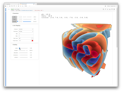

# pyinema JupyterLab Examples

<table>
<tr>
<td style="text-align:center;">Warp</td>
</tr>
<tr>
<td>
    <a href="https://mybinder.org/v2/gh/cinemascience/pycinema-binder/HEAD?filepath=Warp%2Fexample.ipynb">
        </img>
    </a>
</td>
</tr>
</table>

